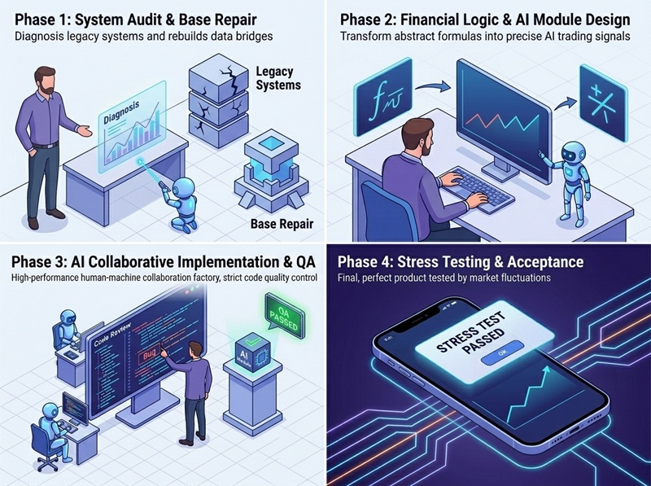
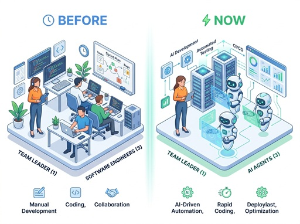
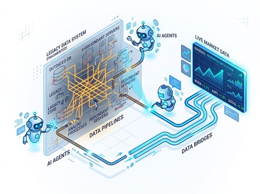

# 2026年更新計畫

- [x] [Phase1：系統檢查與基礎修復](demo2026/2026_Phase1.md)

利用AI工具盤點三年前的系統架構，分析異常模組，找出數據失效根源。

此階段將致力於重新建立穩定的自動化數據抓取引擎，確保基礎資訊與舊有功能正常。

預期完成日: `2026/04/17 (week 1~2)`

- [ ] [Phase2：金融邏輯與 AI 模組設計](demo2026/2026_Phase2.md)

開發 MACD 運算服務及股價突破偵測算法。

此階段將利用 AI 進行多種參數測試，目標是建立精確且反應迅速的訊號觸發機制。

預期完成日: `2026/05/04 (week 3~4)`

- [ ] [Phase3：AI輔助開發與品質管理](demo2026/2026_Phase3.md)

導入完整的AI工作流，整合新的MACD事件模組，引導AI進行功能開發與整合。

此階段將投入大量精力在程式碼審核與AI調試，在引入AI工具的同時也不可犧牲「系統穩定性」為最高準則。

預期完成日: `2026/05/15 (week 5~6)`

- [ ] [Phase4：壓力測試與成效驗收](demo2026/2026_Phase4.md)

完成最終系統測試與優化，驗收APP在實際環境下的運行結果。

預期完成日: `2026/05/29 (week 7~8)`

## 計畫目標

1.	修復舊股票APP功能
2.	新增MACD突破通知功能
3.	透過AI賦能減少開發人力（4人小組→1人團隊）
4.	深度整合AI工作流，提取可複用的AI技能

## 核心摘要

### AI賦能

研究現有的AI輔助工具，**組建1人團隊**取代原本的4人小組分工模式（架構規劃/功能實作/測試除錯）。

### 原功能維護

因為近年來金融新聞平台大多升級了防爬蟲的安全性功能，原專案中多個利用網路爬蟲的功能已經失效。

運用AI深度重構三年前的舊程式碼，修復資料爬蟲失效問題。

### 新功能升級

透過AI助理協助學習MACD相關金融知識，並搭建完整的AI工作流。

整合`MACD訊號計算`並開發`訊號突破主動通知`功能。

