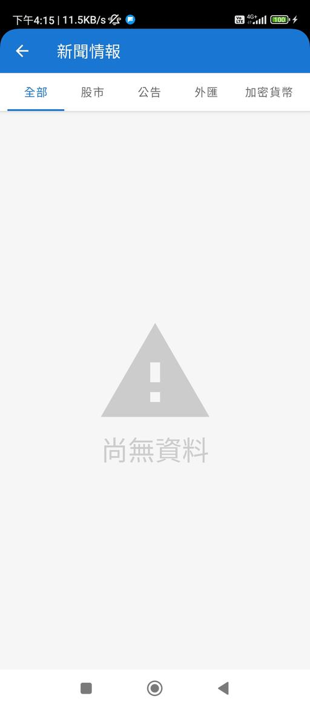
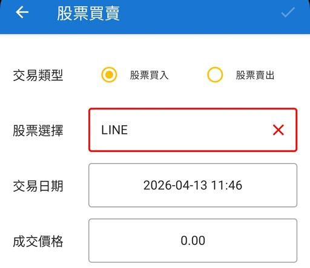
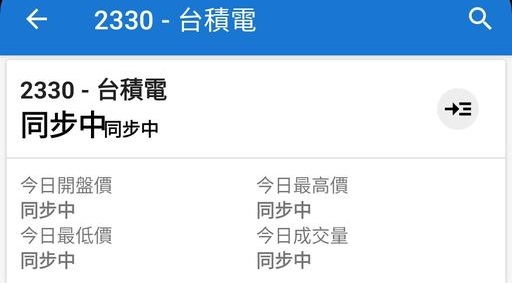
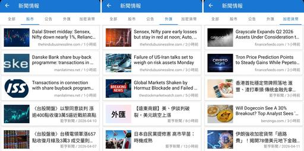

# 2026年更新計畫 Phase1：系統檢查與基礎修復

> **回到2026年更新計畫[請點我](../README_2026.md)**

利用AI工具盤點三年前的系統架構，分析異常模組，找出數據失效根源。

此階段將致力於重新建立穩定的自動化數據抓取引擎，確保基礎資訊與舊有功能正常。

預期完成日: `2026/04/17 (week 1~2)`

## 已知問題

- [x] 多方新聞來源（[已解決](#新聞頁面)）

`Yahoo財經`、`中時新聞網`近年已新增**防爬蟲**機制，原始抓取新聞方法已失效，間接導致新聞頁面癱瘓，無法顯示內容。

- [x] 公司營收統計

原始的營業收入歷史資料來源`mops.twse.com.tw`已經失效，並且以非常嚴格的方式**禁止任何爬蟲手段**取得資料，違者會被封鎖IP禁止訪問網站（如下圖）。

- [x] 上市公司清單

專案最後一次更新截至目前為止已過3年有餘，上市公司已經有大幅度更動，例如`LINEPAY`、`星宇航空`等公司已上市，但原始的專案無法支援新上市公司的查找。

- [x] 表單模組介面

升級Android開發專案後，新版本的UI元素架構無法向下相容導致大量UI介面顯示方式不正確。

- [ ] 個股卡片資訊

個股卡片資訊依賴雲端爬蟲數據，已失效的爬蟲模組導致股票資訊無法順利顯示。

## 開發計畫

### 新聞頁面

原始的新聞來源如下：

- 鉅亨財經新聞
- Yahoo財經（已失效）
- 中時新聞網（已失效）

目前僅剩一個新聞來源，為維護新聞多樣性，特別申請國外專門的新聞串接API `Marketaux`。

Marketaux API會返回全球範圍的金融新聞，等於本專案串接API後可提升**數十個**全新的新聞媒體來源。

### 營收分析

原始的營業收入歷史資料來源`mops.twse.com.tw`已經失效，並且以非常嚴格的方式**禁止任何爬蟲手段**取得資料，違者會被封鎖IP禁止訪問網站（如下圖）。

如上述所示，原始的歷史營收資料取得方式已經確定不可行。

#### [證交所 Open API](https://openapi.twse.com.tw/)

政府與證交所現在大力推動 Open Data，這是目前獲取台股營收資料最穩健且不會被鎖 IP 的方式。

證交所直接提供 JSON 格式的 API 供大眾免費串接。

但是只能取得**最近一個月**的營業收入資訊，歷史資料不足。

#### [FinMind API](https://finmindtrade.com/)

要實現原有功能似乎僅剩需要付費的正式第三方金融API服務。

測試使用FinMind金融API取得公司營收歷史資料。

已申請API KEY並驗證串接可行，嘗試修復營收分析頁面。
