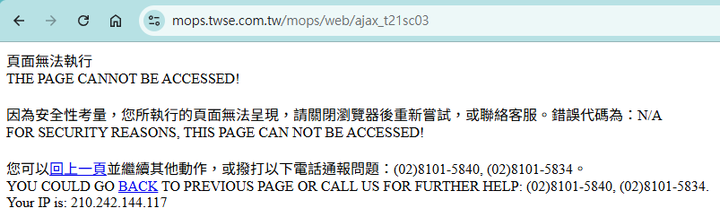
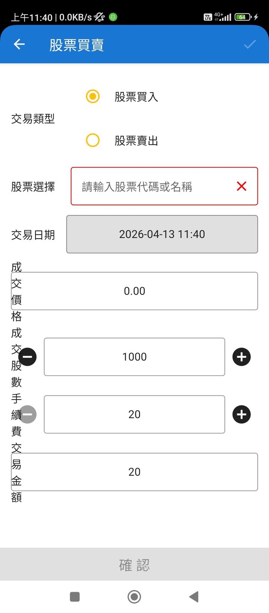
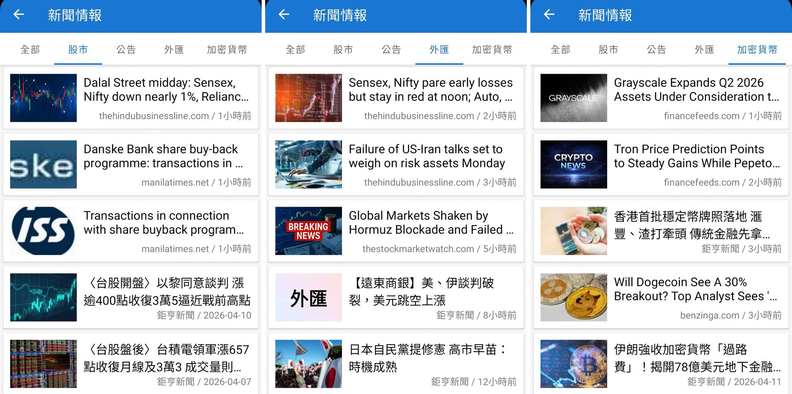
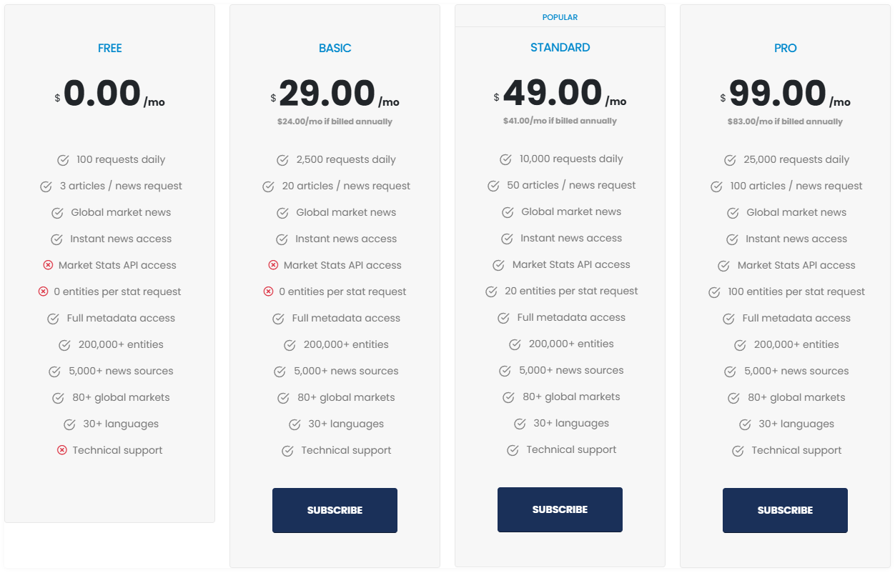
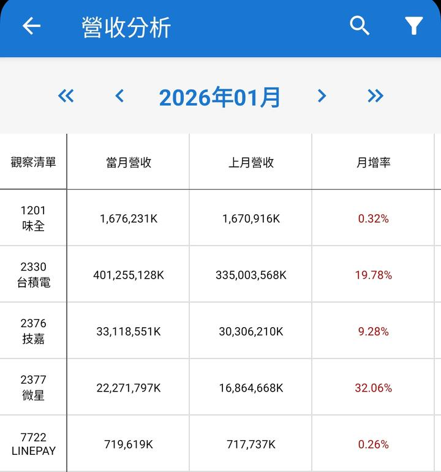
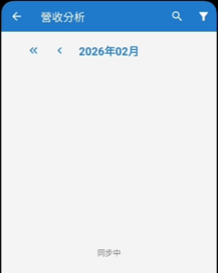
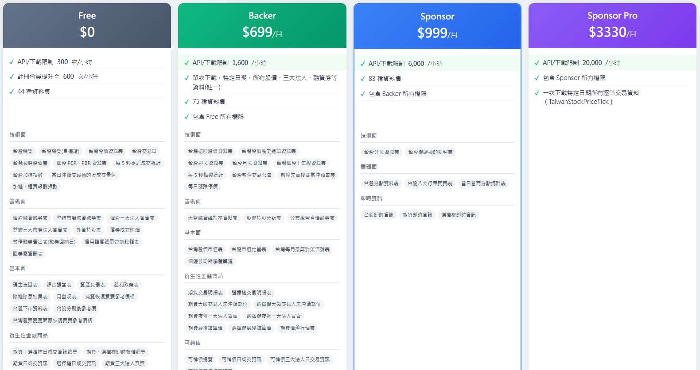
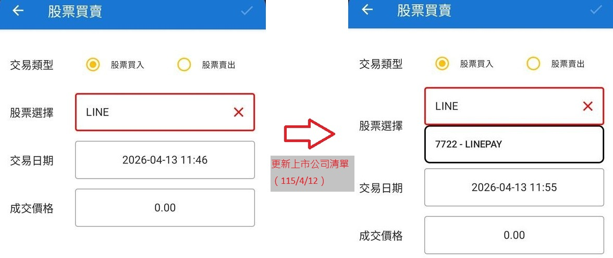
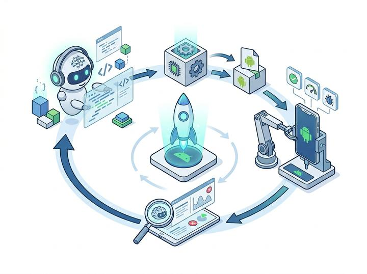
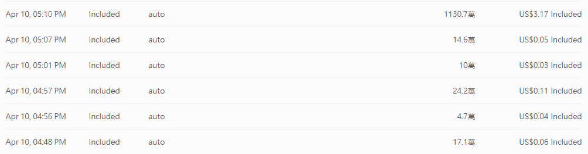

# 2026年更新計畫 Phase1：系統檢查與基礎修復

> **回到2026年更新計畫[請點我](../README_2026.md)**

利用AI工具盤點三年前的系統架構，分析異常模組，找出數據失效根源。

此階段將致力於重新建立穩定的自動化數據抓取引擎，確保基礎資訊與舊有功能正常。

預期完成日: `2026/04/17 (week 1~2)`

## 已知問題

- [x] 多方新聞來源（[已解決](#新聞頁面)）

`Yahoo財經`、`中時新聞網`近年已新增**防爬蟲**機制，相關來源已失效，間接導致新聞頁面癱瘓，無法顯示內容。

- [x] 公司營收統計（[已解決](#營收分析)）

原始的營業收入歷史資料來源`mops.twse.com.tw`已經失效，並且以非常嚴格的方式**禁止任何爬蟲手段**取得資料，違者會被封鎖IP禁止訪問網站（如下圖）。

- [x] 上市公司清單（[已解決](#上市公司清單更新)）

專案最後一次更新截至目前為止已過3年有餘，上市公司已經有大幅度更動，例如`LINEPAY`、`星宇航空`等公司已上市，但原始的專案無法支援新上市公司的查找。

- [x] 表單模組介面（[已解決](#android-16-系統更新支援)）

升級Android開發專案後，新版本的UI元素架構無法向下相容導致大量UI介面顯示方式不正確。

## 新聞頁面

原始的新聞來源如下：

- 鉅亨財經新聞
- Yahoo財經（已失效）
- 中時新聞網（已失效）

目前僅剩一個新聞來源，為維護新聞多樣性，特別申請國外專門的新聞串接API [Marketaux](https://www.marketaux.com/)。

Marketaux API會返回**全球範圍**的金融新聞，等於本專案串接API後可提升**數十個**全新的新聞媒體來源。

整合完成示意

### [Marketaux](https://www.marketaux.com/)

> Instant access to global stock market and finance news also including funds, crypto and more along with comprehensive sentiment analysis.

免費的股票市場與金融新聞串接API，即時獲取全球股市與財經新聞，內容涵蓋基金、加密貨幣等多元領域，並提供全面的情緒分析。

#### 訂閱費用 (2026/4/13更新)

- 免費試用：每日100次呼叫，每次最多3則新聞。
- USD$29/月：每日2,500次呼叫，每次最多20則新聞。
- USD$49/月：每日10,000次呼叫，每次最多50則新聞。
- USD$99/月：每日25,000次呼叫，每次最多100則新聞。

## 營收分析

原始的營業收入歷史資料來源`mops.twse.com.tw`已經失效，並且以非常嚴格的方式**禁止任何爬蟲手段**取得資料，違者會被封鎖IP禁止訪問網站（如下圖）。

如上述所示，原始的歷史營收資料取得方式已經確定不可行。

#### [證交所 Open API](https://openapi.twse.com.tw/)（未採用）

政府與證交所現在大力推動 Open Data，這是目前獲取台股營收資料最穩健且不會被鎖 IP 的方式。

證交所直接提供 JSON 格式的 API 供大眾免費串接。

但是只能取得**最近一個月**的營業收入資訊，歷史資料不足。

#### [FinMind API](https://finmindtrade.com/)

要實現原有功能似乎僅剩需要付費的正式第三方金融API服務。

測試使用FinMind金融API取得公司營收歷史資料。

已申請API KEY並驗證串接，已修復營收分析頁面。

實際操作演示

### [FinMind](https://finmindtrade.com/)

> FinMind 金融 X 大數據。在大數據的時代，資料是一切的基礎。我們收集超過 50 種台股相關資料，並提供下載、線上分析、回測。

開源資料庫：不限程式，皆可藉由 FinMind 提供的 api 下載資料，也可直接在網站上下載資料。有資料後，可進行統計分析、回歸分析、時間序列分析、機器學習、深度學習。

線上分析：針對個股，提供技術面、基本面、籌碼面等視覺化分析。

策略回測：根據不同策略，進行回測分析，提供不同策略投資組合的績效、損益、選股標的。

#### 訂閱費用 (2026/4/13更新)

- 免費試用：每小時600次API呼叫。
- NTD$699/月：每小時1,600次API呼叫。
- NTD$999/月：每小時6,000次API呼叫。
- NTD$3,330/月：每小時20,000次API呼叫。

## 上市公司清單更新

根據2026/04/12台灣股市公開資訊，更新專案中的股票對照清單。

2026/04/12 異動紀錄：

|新增|移除|更新|
|---|---|---|
|133支|16支|38支|

> 新增「星宇航空」、「World Gym」、「LINEPAY」...等上市公司。

## [Android 16](https://developer.android.com/about/versions/16?hl=zh-tw) 系統更新支援

Android 16（內部代號 Baklava）已於**2025年年中**推出正式版與原始碼。

> Android 16 的核心在於進一步強化「**多視窗與跨裝置協作**」，透過整合全新的桌面模式視窗控制、更嚴格的隱私沙盒（Privacy Sandbox）以及強化的通知管理機制，為開發者提供更具靈活性且安全的應用框架。

跨越了整整三年（2023年迄今）的延遲更新，在本次計畫中實現程式碼重組與支援性更新。透過 AI 輔助工具全面盤點專案程式碼架構，推進對 Android 16 最新版本的系統支援。

本次專案升級清單：

|專案項目|原始版本|升級版本|
|---|---|---|
|Android OS|12|16|
|Java JDK|11|17|
|Compile SDK API|32|36|
|Android Gradle Plugin|4.2.1|9.1.0|
|Gradle Wrapper|7.4.2|9.4.1|
|Kotlin|1.5.21|2.3.20|
|AndroidX AppCompat|1.4.1|1.7.1|
|Material Components|1.5.0|1.13.0|
|AndroidX Lifecycle|2.3.1|2.10.0|
|AndroidX Navigation|2.4.2|2.9.7|
|AndroidX RecyclerView|1.2.1|1.4.0|
|Room|2.3.0|2.8.4|

跨越三年的更新，部分項目無法向下相容，升級的同時也要進行大規模的程式碼重構，這部分往往是最消耗開發者時間心力的移植工作，因此嘗試搭建 AI Agent 自我檢測機制，讓 AI 自主完成任務。

AI 自動化開發工作流設計如下：

1. 軟體開發
2. 編譯安裝檔
3. 實機安裝測試
4. 結果驗證與檢討
5. 回到1.直到達成目標

系統升級計畫所消耗的AI工具成本如下：

|AI Token消耗|換算成本|
|---|---|
|1200萬+|USD$3.46|

### 全自動化 AI 開發工作流的檢討

在缺乏人工監管的情況下，無限制工作流可能在不斷嘗試的過程中消耗大量成本卻無法達成目標。

例如本次專案升級沒有人工指導，中途有觀測到明顯的不良操作，但本著實驗精神沒有進行效率指導干預，最終只運行一次自主工作流的AI成本就高達**3.17美金**，且沒有完美達成目標，最後還是要人工介入修正問題。