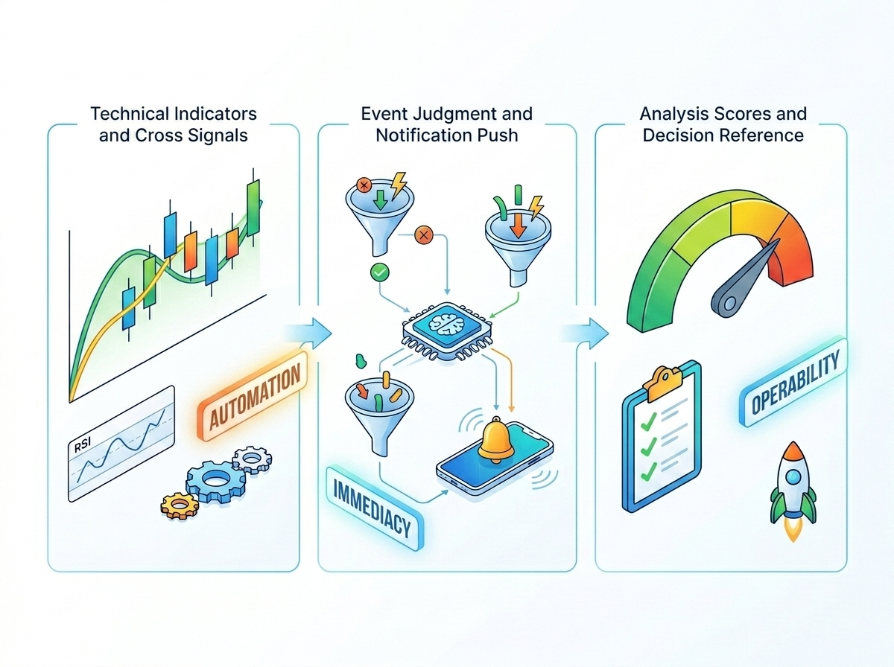
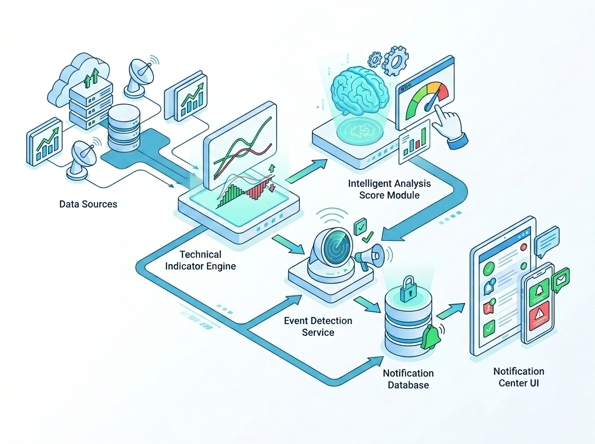
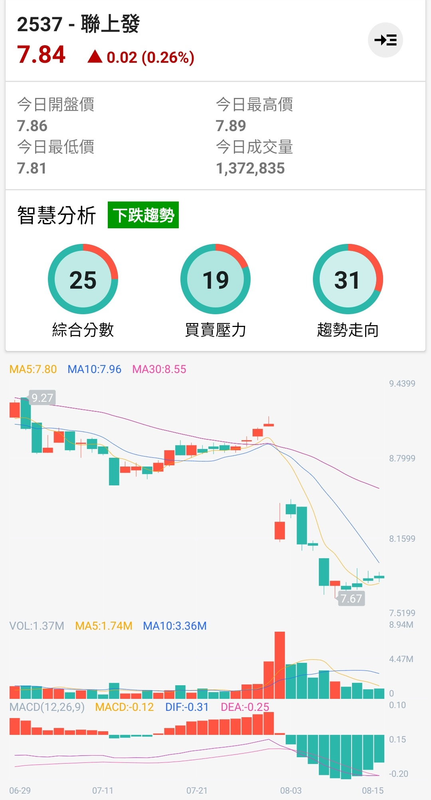
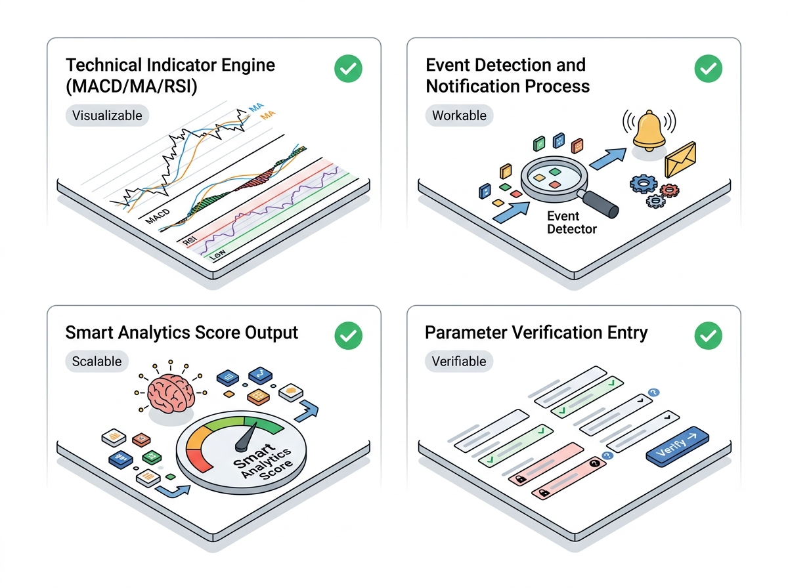

# 2026年更新計畫 Phase2：金融邏輯與 AI 模組設計

> **回到2026年更新計畫[請點我](../README_2026.md)**

開發 MACD 運算服務及股價突破偵測算法。

此階段將利用 AI 進行多種參數測試，目標是建立精確且反應迅速的訊號觸發機制。

預期完成日: `2026/05/04 (week 3~4)`

## 核心工作

- [x] `自動化`：建立技術指標運算底層
- [x] `即時性`：實作事件偵測與通知流程
- [x] `可控性`：建立 AI/智慧分析評分能力與參數驗證

## 技術指標引擎落地（含 MACD）

已完成技術指標運算能力整合，支援：

- 主圖指標：MA、EMA、BOLL
- 副圖指標：MACD、KDJ、RSI

其中 MACD 已可輸出 `DIF / DEA / MACD`，提供後續事件判斷與視覺化基礎。

https://github.com/user-attachments/assets/c2b5f921-ad49-4055-bfbc-532ec68d5e3f

## 事件偵測與通知流程

已完成「觀察清單股票」自動掃描與通知生成流程：

1. 讀取觀察清單
2. 下載歷史資料並計算 MA
3. 判定突破/跌破事件
4. 進行事件去重
5. 寫入通知中心並顯示未讀數

可依使用者設定切換關注等級（保守/穩健/積極），對應 MA30、MA10+30、MA5+10+30。

## 智慧分析分數引擎

已建立技術分析（TA）評分模型：

- 指標來源：`RSI`、`PPO`、`Williams %R`
- 輸出：短期分數、趨勢分數、綜合分數
- 已接入分析畫面與帳戶計算流程

目前可穩定提供「量化分數」，供 UI 與內部驗證使用。

## 參數測試入口建立

已建立內部測試活動 `TaTestActivity`，可針對歷史區段執行：

- 指標分數計算
- 預測分數與後續報酬率對照
- 基礎錯誤訊號判讀（loss 檢查）

此能力已可用於策略方向驗證，符合本階段範圍。

## 開發進度清單

- [x] `可視化`：訊號通知能力已從「規劃」進入「可視化」階段  
- [x] `可用性`：透過可調整關注等級，讓使用者可依風險偏好調整訊號密度 
- [x] `可擴充`：分析模組已具備量化分數輸出架構，為後續階段保留擴充彈性  
- [x] `可驗證`：標準化測試流程驗證技術指標可行性，減少主觀判讀成本

