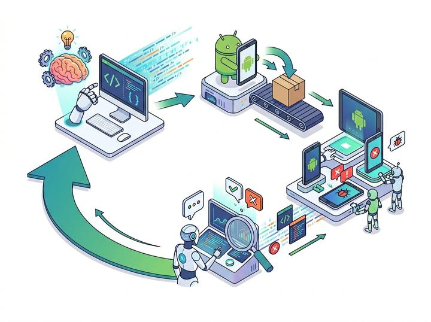
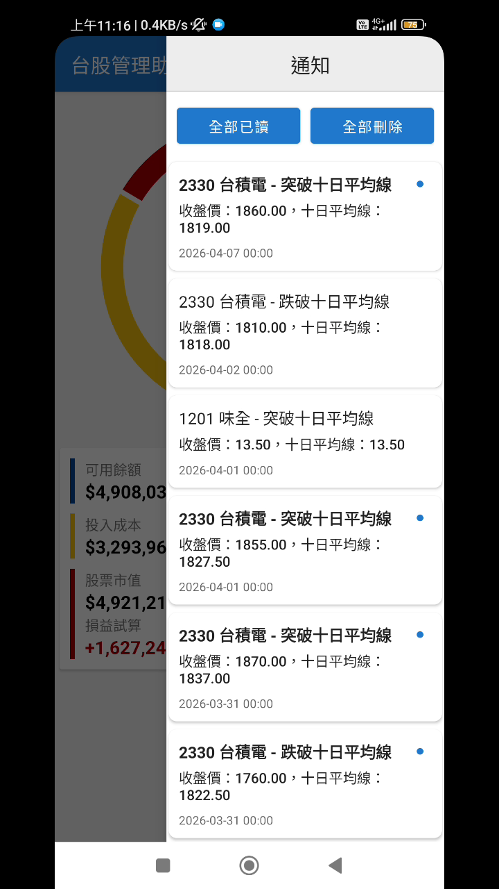
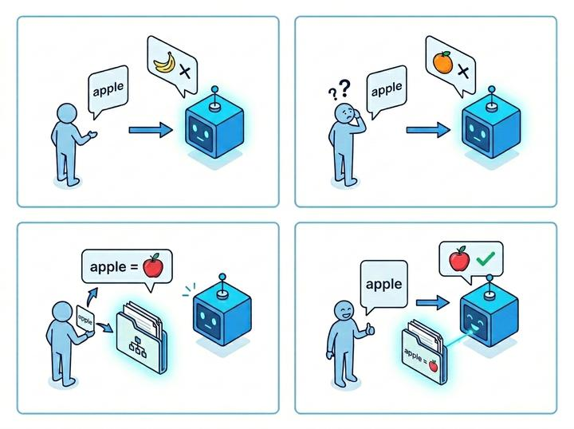
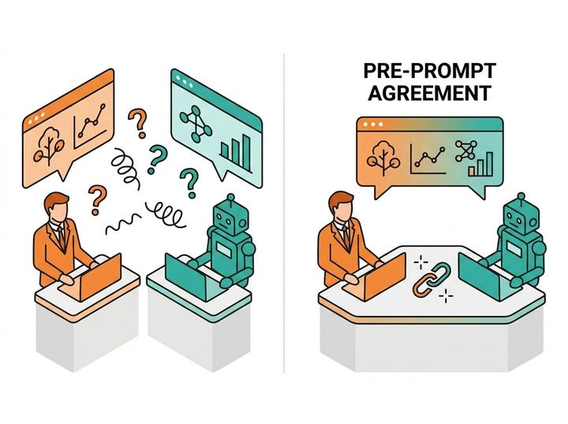
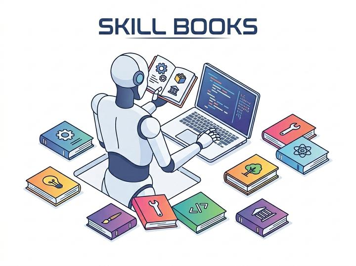
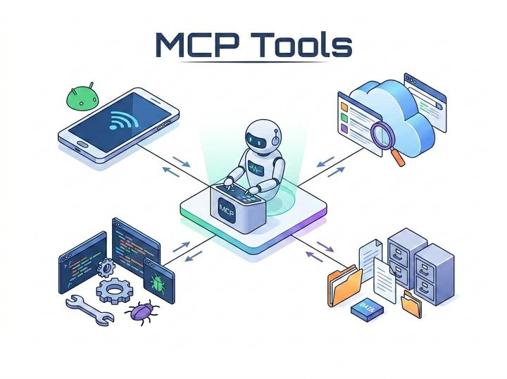

# 2026年更新計畫 Phase3：AI輔助開發與品質管理

> **回到2026年更新計畫[請點我](../README_2026.md)**

導入完整的AI工作流，整合新的MACD事件模組，引導AI進行功能開發與整合。

此階段將投入大量精力在程式碼審核與AI調試，在引入AI工具的同時也不可犧牲「系統穩定性」為最高準則。

預期完成日: `2026/05/15 (week 5~6)`

## 通知頁面上線

首頁加入通知頁面，支援以下功能：

- **滑動喚醒**：**全螢幕手勢**支援喚醒通知頁面
- **已讀通知**：支援已讀並保留通知內容
- **滑動刪除**：支援滑動刪除個別通知
- **範圍操作**：一鍵`全部已讀`、`全部刪除`

操作示範影片如下：

https://github.com/user-attachments/assets/b78dea26-a74e-4e49-8188-8badaf92ab1b

## 進階 AI 智慧分析

優化智慧分析算法，圖表全面進化：

- **演算法進化**：多種財經數據支援（`MA<N>`、`MACD`、`RSI`、`PPO`、`Williams %R`...）
- **智慧分析算法**：基於各項指標，改進量化分數算法，數據更可靠
- **走勢圖升級**：可一次性載入一年份的數據，大幅提升數據可視性
- **圖表性能提升**：底層圖表改進，觀看年度走勢圖也能享有順暢的操作體驗

https://github.com/user-attachments/assets/c2b5f921-ad49-4055-bfbc-532ec68d5e3f

## AI 全自動工作流

之前在 `Phase 1` 已經完成實驗性 AI 全自動開發流程：

明顯的缺點在於**金錢成本**與**時間成本**的不可控因素（參考[全自動化 AI 開發工作流的檢討](2026_Phase1.md#全自動化-ai-開發工作流的檢討)）。

每次任務高昂的開發費用以及未知的開發時長都會導致 AI 開發者的工作流不順暢從而影響生產力。

專業的開發人員應該在合理的費用、適當的時程下完成產品開發。

為此**優化 AI 工作流**的方法，如何與 AI 基於共識去開發產品，就成了當代的新顯學。

## AI 工作流深度優化

要進一步優化 AI 流程，大致可分為以下方向：

### 預提示詞（Pre-prompt）

Pre-prompt 是人機共識最重要的一條主線，缺乏 Pre-prompt 的工具會在每次開啟新對話時**遺忘所有前提**，等於你必須同頭開始教導 AI 記住專案中的細節。

透過 Pre-prompt 設定，我們可以告訴 AI 代理一些專案中必要遵守的規則，相較於那些沒有設定合理 Pro-prompt 的專案，可節省至少 **30% 以上**的 Token 費用消耗。

> 反覆的人機問答，錯誤的執行方向，都會導致 Token 用量浪費

### 技能書（SKILL）

SKILL 是目前針對 AI 代理的最佳收斂及引導工具，等於給 AI 一本技能手冊，告訴他專案架構、常見問題、處理流程...

現代化的 AI 代理**只在必要的時候才會閱讀**指定的 SKILL 內容，因此專案中即使導入大量的 SKILL 方案，也沒有 Token 浪費問題。

正確的 SKILL 導入，有機會將 AI 執行準確率提升至 **95% 以上**，可以最大程度的避免 AI 算力資源的浪費，這是很多 AI 開發者會忽略的基本功。

### Model Context Protocol（MCP）Toolkits

MCP 是一個讓 AI 能夠連接外部工具的統一接口

透過載入不同功能的 MCP 工具，我們可以讓專案的 AI 使用以下能力：

- `本地檢索`：搜尋系統中的指定路徑文件
- `網路搜尋`：使用搜尋引擎、閱讀線上文件
- `應用部屬`：對行動裝置進行 APP 安裝、啟動、控制
- `除錯排查`：蒐集真實行動裝置的錯誤日誌並排查問題

隨著 MCP 開放協議生態的發展，越來越多的 MCP 免費工具可供下載，每個 MCP 工具都可以被任意 AI 代理輕鬆地安裝及卸載，就像是個可拆裝的動態模組，根據不同的專案需求載入不同的工具。

### 優化成果

本階段嘗試導入以上優化方案，在提升 AI 強度的同時還能省下開發費用，演示如下：

https://github.com/user-attachments/assets/6e1f573d-de69-4d1a-8770-aff3aa4637d4