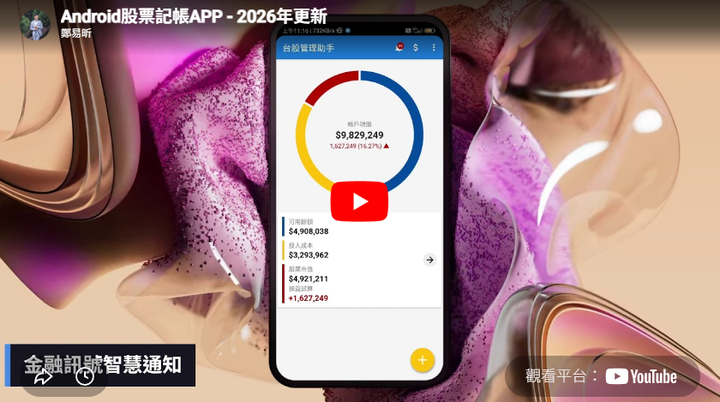

# 2026年更新計畫 Phase4：壓力測試與成效驗收

> **回到2026年更新計畫[請點我](../README_2026.md)**

完成最終系統測試與優化，驗收APP在實際環境下的運行結果。

預期完成日: `2026/06/12 (week 7~10)`

## 已完成目標

- [x] `修正新聞來源失效`
- [x] `修正營收來源失效`
- [x] `新增通知頁面`
- [x] `新增平均線穿透事件`
- [x] `網路爬蟲的穩定性優化`

## 成果展示

> 影片檔案太大，請點擊下方圖片前往Youtube平台觀看

